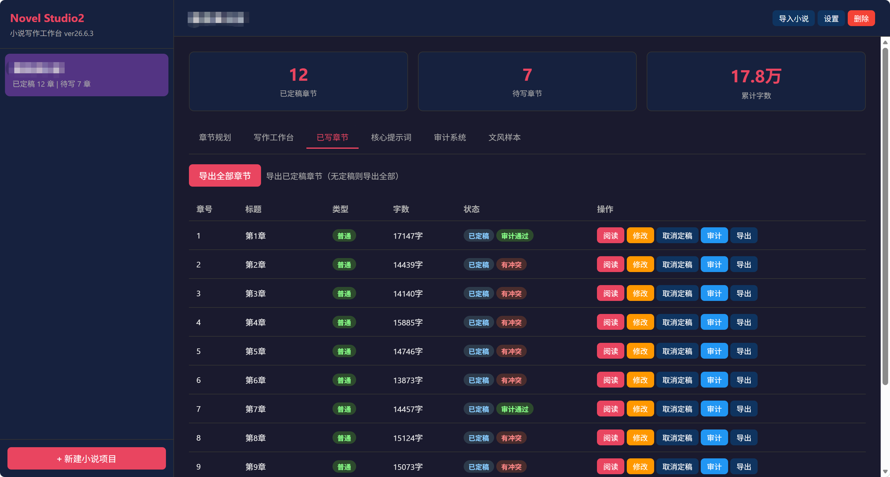

<h1 align="center">Novel Studio2<br><sub>小说写作智能体工作台</sub></h1>

<p align="center">
  
  
  
</p>

---

专为长篇小说写作设计的 AI 工作台。深度适配 DeepSeek V4 Flash，充分利用 **100 万 token 超长上下文**，让 AI 一次性"读完"你的整本书，告别上下文碎片化。

<p align="center">
  
</p>

## 为什么选择 Novel Studio2

### 🧠 100 万 token 上下文，真正"读懂"长篇

传统 AI 写作工具受限于 8K-128K 上下文，写到后期"忘记"前期设定。Novel Studio2 专为 DeepSeek V4 Flash 的 1M 上下文窗口优化：

- **一次性注入全书内容** — 核心提示词 + 已写章节 + 角色卡片 + 剧情概述，全部塞进上下文
- **384K 最大输出** — 单次生成超长章节，无需拼接
- **剧情连贯** — AI 能"看到"第 1 章的伏笔，也能"记得"第 50 章的角色状态变化

### 🎯 结构化核心提示词

将传统"一大坨"提示词拆解为 5 个独立模块，精准控制 AI 创作方向：

| 模块 | 内容 | 用途 |
|------|------|------|
| 基础设定 | 世界观、背景、核心规则 | 让 AI 理解你的世界 |
| 角色卡片 | 每个角色独立卡片 | 防止角色"人设崩塌" |
| 剧情概述 | 已写章节梗概 | 保持剧情连贯 |
| 文风设定 | 叙述视角、语言风格 | 统一全书文风 |
| 续写方向 | 当前走向、冲突线索 | 引导剧情发展 |

### 📝 智能写作工作台

- **流式输出** — 实时查看 AI 生成内容，边写边看
- **手动编辑** — 随时介入修改，Ctrl+S 即时保存
- **AI 调整** — 输入修改意见，AI 针对性重写
- **一键定稿** — 满意后定稿，自动进入审计流程

### 🔍 多维度审计系统

写完自动审计，防止剧情穿帮：

- **资源追踪** — 财富、物品、人物状态、伏笔全记录
- **冲突检测** — 时间线、人物、物品、设定、数值、伏笔 6 类冲突自动识别
- **审计报告** — 可视化报告，冲突一键解决

### 📥 小说导入

已有小说？直接导入续写：

- 上传 TXT → AI 分析 → 自动拆分章节 → 生成结构化提示词
- 支持"第X章/节/回/卷"等多种格式
- 50MB 文件限制，正则拆分 100% 可靠

## 快速开始

### 安装

```bash
# 克隆项目
git clone <repository-url>
cd Novel_Studio2

# 安装依赖
pip install -r requirements.txt
```

### 配置

复制示例配置文件并编辑：

```bash
cp config.example.yaml config.yaml
```

编辑 `config.yaml`，填入你的 API 配置：

```yaml
api:
  base_url: "https://api.example.com/v1"  # 替换为你的 API 端点
  api_key: "your-api-key-here"            # 替换为你的 API Key
  model: "deepseek-v4-flash"              # 模型名称
  max_tokens: 384000                       # 最大输出 token 数
  context_window: 1000000                  # 1M 上下文窗口
  temperature: 0.8                         # 温度参数
```

或通过环境变量覆盖 API Key（推荐，更安全）：

```bash
export NOVEL_API_KEY="your-api-key"
```

### 启动

```bash
python run.py
# 或双击 start.bat（Windows）
```

访问 http://127.0.0.1:8000

## 功能一览

| 功能 | 说明 |
|------|------|
| 小说项目管理 | 创建/编辑/删除，独立目录存储 |
| 章节规划 | AI 生成规划，支持方向提示词，类型系统（普通/重点/转折） |
| 写作工作台 | 流式写作 + 手动编辑 + AI 调整 + 定稿 |
| 已写章节 | 列表、阅读、导出（单章/全书） |
| 核心提示词 | 5 模块独立编辑，AI 自动更新 |
| 审计系统 | 资源追踪 + 冲突检测 + 审计报告 |
| 文风样本 | 上传样本，写作时自动附加 |
| 统计仪表盘 | 章节数、字数、进度一目了然 |

## 工作流程

```
创建项目 / 导入小说
    ↓
编辑核心提示词（5 个模块）
    ↓
生成章节规划（可自定义方向）
    ↓
逐章写作（流式生成 → 审核 → 修改 → 定稿）
    ↓
自动审计（资源追踪 + 冲突检测）
    ↓
导出全书（TXT 格式）
```

## 项目结构

```
Novel_Studio2/
├── app/
│   ├── main.py               # FastAPI 主应用
│   ├── api/                  # API 路由（35 个端点）
│   ├── core/                 # 核心逻辑（7 个模块）
│   ├── models/               # 数据模型（3 个）
│   └── templates/
│       └── index.html        # Web 前端（暗色主题 SPA）
├── data/                     # 小说数据（运行时生成）
├── config.yaml               # API 配置
├── requirements.txt          # Python 依赖
└── run.py                    # 启动脚本
```

## 技术栈

| 组件 | 技术 | 说明 |
|------|------|------|
| 后端 | Python FastAPI | 异步高性能 Web 框架 |
| 前端 | 单页 HTML/JS | 暗色主题，~1700 行 |
| 存储 | 本地文件系统 | JSON 元数据 + TXT 内容 |
| AI | DeepSeek V4 Flash | 1M 上下文，384K 输出 |
| 写入 | 非原子写入 | temp + rename 防数据损坏 |

## 许可证

MIT

---

<p align="center">
  <sub>专为长篇小说创作者打造 · 充分利用 100 万 token 上下文</sub>
</p>
